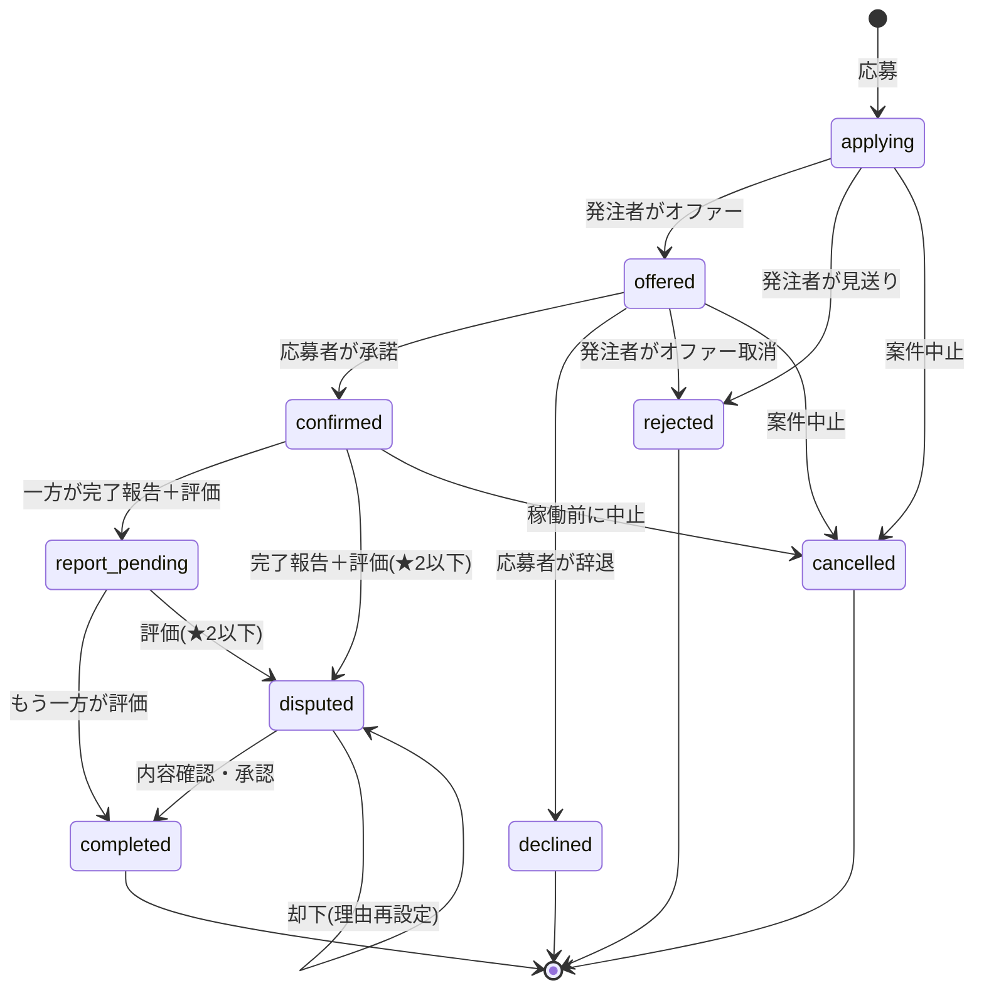

# ステータスモデル仕様(案件ごとのステータス表示)

## この文書について

「案件ごとのステータスを表示する」機能のための、ステータス設計の確定版。
[SPECIFICATION.md](SPECIFICATION.md) が現行実装のリバースエンジニアリングであるのに対し、本書は**これから実装する目標設計**を定義する。

2026-09-10 決定。決定済みの前提:

1. 稼働待ち / 稼働中 / 稼働終了 は**保存しない**。状態機械としては「契約確定(`confirmed`)」1つだけを保存し、表示ラベルは「今日の日付 vs 稼働日」から計算する(定期バッチ不要)。
2. 契約書の承認は稼働の**前提条件にしない**。「稼働待ち」の中のサブフラグ(バッジ表示)として扱う。ただし運用開始後に独立ステータス化する可能性があるため、いつでも独立させられる設計にする([§6](#6-契約書承認を将来独立ステータス化するための設計))。
3. このステータスは **「応募状況・履歴」画面と「案件管理」画面の両方**に表示する。
4. 「締切間近」は締切まで **2日** を基準とする。
5. `offered` からの発注者による取消は独立ステータスを設けず **`rejected`** にまとめる。
6. 完了報告の評価が低い場合の状態(内部キー `disputed`)は、対立的な印象を避けるため表示ラベルを **「内容確認中」** とする(内部キーは `disputed` のまま。`rejected`→「見送り」等と同じく、内部キーとユーザー向けラベルを分ける方針)。この状態の解消(承認/却下)UI 導線も本実装スコープに含める。
7. 軸A「募集終了」(全枠確定)は初回リリースに入れたい機能だが、定員フィールドの新設が前提のため**今回の実装パスではスコープ外**とし、当面「掲載締切」で代用する。

---

## 1. 2つのステータス軸

現行コードと同様、ステータスは独立した2軸で構成する。混同しないこと。

| 軸 | 対象 | 個数 | 主に見る人 | 現行フィールド |
|---|---|---|---|---|
| **軸A: 掲載ステータス** | 案件(募集)そのもの | 1案件に1つ | 発注者 | `Job.status` |
| **軸B: 応募・契約ステータス** | 「応募企業 × 案件」1組 | 応募1件に1つ | 発注者・応募者・スタッフ | `ContractTask.status`(要再設計) |

「案件ごとのステータスを表示する」の主対象は**軸B**。軸Aは発注者の「案件管理」画面で併記する。

---

## 2. 軸A: 掲載ステータス

### 2.1 一覧

| ラベル | 意味 | 判定 |
|---|---|---|
| 掲載中 | 応募受付中 | `Job.status==='active'` かつ 今日 ≤ 応募締切日 |
| 締切間近 | 締切まで残りわずか(表示のみ・掲載中の一種) | `active` かつ 応募締切日 − 2日 ≤ 今日 ≤ 応募締切日 |
| 掲載締切 | 応募締切を過ぎた(選考・稼働は継続しうる) | `active` かつ 今日 > 応募締切日 |
| 募集停止 | 発注者が取り下げた | `Job.status==='cancelled'` |

### 2.2 保存 vs 計算

- **保存**するのは `Job.status`(`active` / `cancelled`)のみ。現行のまま。
- 掲載中 / 締切間近 / 掲載締切 は `applicationDeadline` と今日の日付から**計算**する。

### 2.3 今回スコープ外(初回リリースで対応予定)

- **募集終了**(全枠が確定した / 全稼働が完了した): `Job` に定員(必要人数)フィールドが無いため、まず定員フィールドを追加し、「確定した応募数 ≥ 定員」で判定する。初回リリースに入れたい機能だが、今回の実装パスでは「掲載締切」で代用する。

---

## 3. 軸B: 応募・契約ステータス(状態機械)

### 3.1 保存する状態

| 保存値 | 標準ラベル | 意味 | 現行 `ContractTask.status` からの変更 |
|---|---|---|---|
| `applying` | 選考中 | 応募済み。発注者が選考中 | 変更なし |
| `offered` | 内定・承諾待ち | 発注者がオファーを送信。応募者の承諾/辞退待ち | 変更なし |
| `confirmed` | 契約確定 | 応募者が承諾。稼働待ち/稼働中/稼働終了はここから日付計算 | **`working` からリネーム** |
| `report_pending` | 評価待ち | 一方が完了報告+評価を提出。もう一方の評価待ち | 変更なし |
| `completed` | 完了 | 双方の評価が完了 | 変更なし |
| `disputed` | **内容確認中** | 完了報告の評価が★2以下。完了前に双方で内容を確認・調整する | ラベルのみ変更(内部キーは `disputed` のまま) |
| `rejected` | 見送り | 発注者が不採用にした / オファーを取り消した | 変更なし |
| `declined` | 辞退 | 応募者がオファーを辞退した | 変更なし |
| `cancelled` | キャンセル | 稼働前に取消(案件中止・体制変更等) | **新規追加** |

終端状態: `completed` / `rejected` / `declined` / `cancelled`。
`disputed` は準終端(`completed` へ遷移しうる)。

### 3.2 状態遷移図



### 3.3 `confirmed` の表示ラベル(日付から計算)

`confirmed` の1状態を、稼働日(`Job.eventDate` / `dailyPrices` のキー)と今日の日付から3つに出し分ける。

| 条件 | 表示ラベル |
|---|---|
| 今日 < 最初の稼働日 | 稼働待ち |
| 最初の稼働日 ≤ 今日 ≤ 最終稼働日 | 稼働中 |
| 今日 > 最終稼働日 | 稼働終了(報告待ち) |

補足:
- 稼働日が単日なら「最初=最終」。
- 稼働日が未設定のときは「稼働待ち」を既定とする。
- 「稼働終了(報告待ち)」= 稼働は終わったが、まだ誰も完了報告を出していない状態。完了報告が出た瞬間に保存値が `report_pending` に変わる。

### 3.4 契約書承認(稼働待ちのサブフラグ)

- 保存値は `confirmed` のまま。契約書が未承認でも遷移はブロックしない。
- `confirmed` かつ「契約書承認が必要 & 未承認」のとき、**「稼働待ち」ラベルに『契約書承認待ち』のサブバッジ**を付ける(独立ステータスにはしない)。
- 承認状態の判定は現行の `contractApproved` 派生ロジックを流用:
  `clientContractApprovedByClient && clientContractApprovedByAgency && (!agencyContractText || (agencyContractApprovedByClient && agencyContractApprovedByAgency))`
- 承諾時(`offered → confirmed`)に、後で独立ステータス化しやすいよう `jobStates[jobId].contractApprovalRequired = true` のようなサブフラグを持たせておく([§6](#6-契約書承認を将来独立ステータス化するための設計))。

---

## 4. 視点別の表示ラベル

同じ保存値でも、見る人によって文言を変える(状態そのものは同じ)。

| 保存値(+計算) | 発注者から見た表示 | 応募者から見た表示 |
|---|---|---|
| `applying` | 選考中(応募あり) | 選考中 |
| `offered` | 内定通知済み(返答待ち) | 内定が届いています(要返答) |
| `confirmed` / 稼働待ち | 稼働待ち | 稼働待ち |
| `confirmed` / 稼働待ち + 契約書未承認 | 稼働待ち(契約書承認待ち) | 稼働待ち(契約書承認待ち) |
| `confirmed` / 稼働中 | 稼働中 | 稼働中 |
| `confirmed` / 稼働終了 | 稼働終了(報告待ち) | 稼働終了(報告待ち) |
| `report_pending` | 評価待ち | 評価待ち |
| `completed` | 完了 | 完了 |
| `disputed` | 内容確認中 | 内容確認中 |
| `rejected` | 見送り | 不採用 |
| `declined` | 辞退された | 辞退済み |
| `cancelled` | キャンセル | キャンセル |

実装上は、ラベル解決を**1つの関数に集約**する:

```
getEngagementStatusLabel(engagement, job, viewer, today) -> { key, label, badge?, color }
```

この関数を「応募状況・履歴」「案件管理」の両方から呼ぶ。ラベルの分岐・文言・色を1箇所に閉じ込めることで、[§6](#6-契約書承認を将来独立ステータス化するための設計) の変更や文言調整の影響範囲を最小化する。

---

## 5. 表示場所

### 5.1 応募状況・履歴(応募者の画面)

- 現状は `task.status`(チャット単位)をそのまま表示しており、1つのチャットで複数案件に応募した場合に誤表示される([todo.md の未修正バグ参照](todo.md))。
- 本モデルでは**案件ごと**の状態を表示する。1行 = 1応募(応募企業 × 案件)。

### 5.2 案件管理(発注者の画面)

- 案件一覧の各行に**軸A(掲載ステータス)**を表示。
- 各案件を開くと、その案件への応募一覧に**軸B(応募・契約ステータス)**を応募企業ごとに表示。

---

## 6. 契約書承認を将来独立ステータス化するための設計

運用開始後、「契約書承認待ち」を `confirmed` のサブフラグではなく独立した保存ステータスにしたくなった場合に、影響を最小限にするための約束事。

### 6.1 いま守っておくこと

- **ラベル解決は `getEngagementStatusLabel()` の1関数に集約**する(§4)。分岐をあちこちにコピペしない。
- 承諾ハンドラで、承認が必要かどうかを `jobStates[jobId].contractApprovalRequired`(または同等のサブフィールド)に記録しておく。今は表示バッジの判定にしか使わないが、独立化のときの起点になる。
- 遷移ロジック(`offered → confirmed` など)も、できれば1つの `transitionEngagement(engagement, event)` 的な関数にまとめる。

### 6.2 独立化するときの手順(見込み)

1. 保存値に `contract_review`(契約書承認待ち)を追加。
2. 承諾ハンドラ: `contractApprovalRequired` が true なら `confirmed` の代わりに `contract_review` をセット。
3. 双方の承認が完了した時点で `contract_review → confirmed` の遷移を追加。
4. `getEngagementStatusLabel()` に `case 'contract_review'` を追加。

→ `applying` / `offered` より前も、`report_pending` 以降も**一切変更不要**。ラベル関数と遷移関数が集約されていれば、変更は数箇所で済む。

---

## 7. 現行コードからの移行

### 7.1 保存値のマッピング

| 現行 `ContractTask.status` | 新 保存値 |
|---|---|
| `applying` | `applying` |
| `offered` | `offered` |
| `working` | `confirmed`(リネーム) |
| `report_pending` | `report_pending` |
| `completed` | `completed` |
| `disputed` | `disputed` |
| `rejected` | `rejected` |
| `declined` | `declined` |
| (なし) | `cancelled`(新規) |

### 7.2 「案件ごとのステータス」をどこに保存するか

現行の `ContractTask.status` はチャット単位。案件単位にするには保存場所を変える必要がある。

- **近道(推奨・第1段階)**: `evaluations.jobStates: { [jobId]: { status, updatedAt, contractApprovalRequired? } }` を新設。応募日を案件ごとに持たせた `appliedJobDates` と同じパターン。チャット全体の `status` は当面残しつつ、表示・遷移を `jobStates` ベースに1つずつ移行する。
- **本命(第2段階)**: `ContractTask` 型を「チャットスレッド」「応募/オファー」「実契約」に分離する([todo.md の改善提案参照](todo.md))。`jobStates` はその中間形態として無駄にならない。

### 7.3 影響範囲

`ContractTask.status` / `Job.status` を参照している箇所はコード全体で **85箇所以上**(`src/pages/` `src/components/` `src/data/mockDb.ts`)。一括置換ではなく、以下の順で段階移行する。

1. `getEngagementStatusLabel()` / `getJobListingStatus()` を新設(表示のみ、既存ロジックは触らない)。ラベル・色・サブバッジ・視点別文言(§4)を全てこの2関数に閉じ込める。
2. 「応募状況・履歴」「案件管理」の表示をこの関数経由に差し替え。案件管理の一覧行には軸A、応募一覧には軸Bを表示。
3. `jobStates` マップ(`evaluations.jobStates: { [jobId]: { status, updatedAt, contractApprovalRequired? } }`)を新設し、書き込み(応募・オファー・承諾・報告・評価・見送り・辞退)を案件ごとに移行。
4. `working` → `confirmed` リネーム、`cancelled` 追加。稼働前キャンセルの導線(発注者/応募者どちらから可能か要検討)を実装。
5. `disputed`(表示:内容確認中)の解消 UI を「管理 > 報告・評価」に追加。`respondToDispute`(承認→`completed` / 却下→`disputed` のまま理由再設定)は実装済みなので、ボタンと確認モーダルを繋ぐ。
6. `relatedTasks` / `channels` / `BottomNav` バッジなど、残りの参照箇所を移行。

---

## 8. 未決事項(実装時に確定)

- 稼働前キャンセル(`* → cancelled`)は発注者・応募者どちらから可能にするか。両者可か、片方のみか。
- キャンセル時に相手への通知(チャットへのシステムメッセージ)を出すか。
- `jobStates` 導入後、チャット全体の `ContractTask.status` を当面どう保つか(後方互換のため「最も進んだ案件の状態」を入れる等)。
